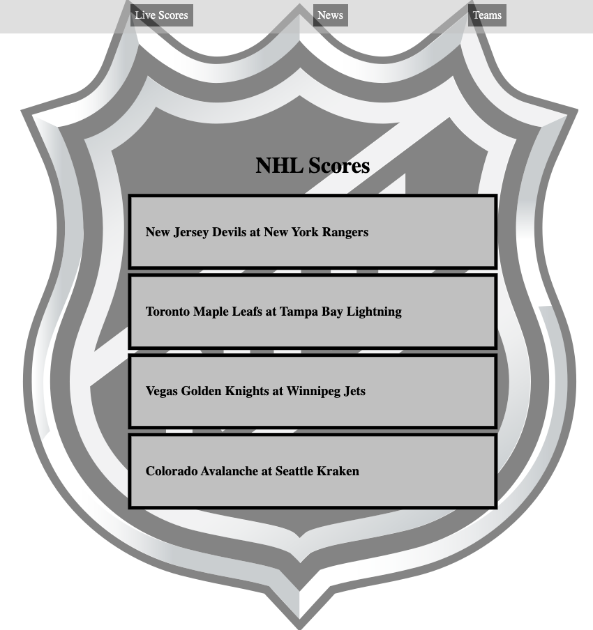
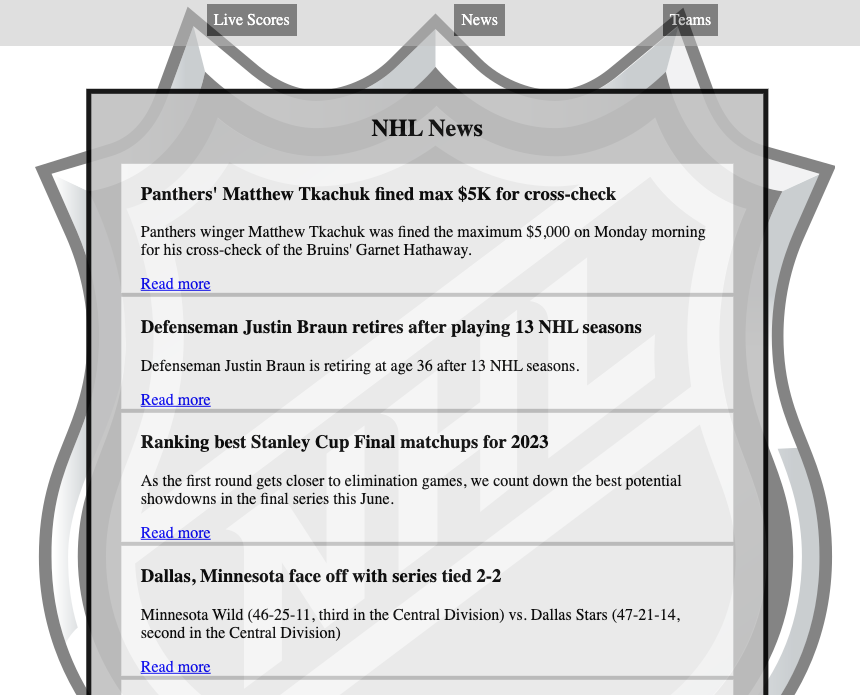
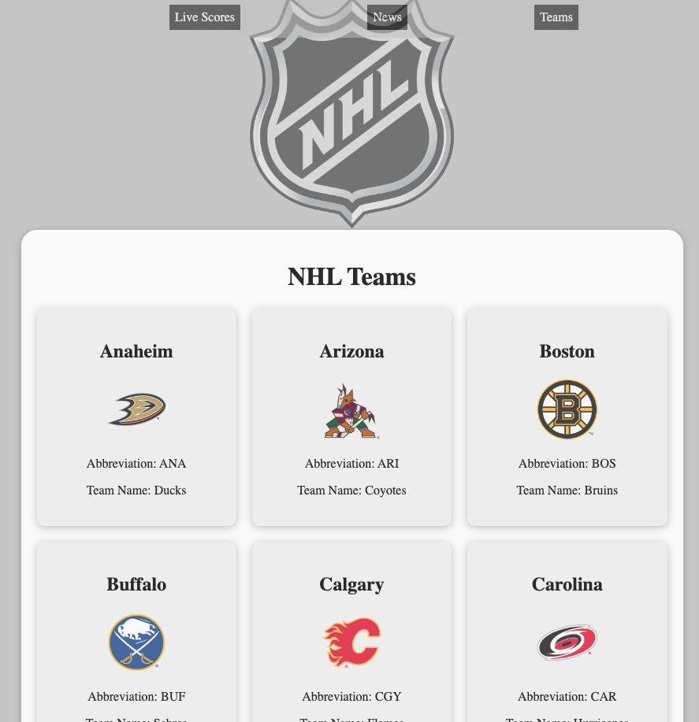

# About

This is a React app that displays live NHL scores, odds, news and a full list of NHL teams. It retrieves data from the ESPN API and displays it in a simple and intuitive way.

## Getting Started

* To get started with this project, follow these steps:

* Clone the repository to your local machine, make sure you are in the correct directory.
* Run `npm install` to install the required dependencies
* Start the development server with `npm start`
* Navigate to `http://localhost:3000` in your browser to view the application

## What-I-Learned
* The first the I learned in creating this app is finding a great API is probably the most difficult part.
* I also enjoyed learning about a timeHandler and how to convert time from UTC into EST using this method: 
```
    let timeHandler = (time) => {
    let date = new Date(time);
    let options = {
      month: "2-digit",
      day: "2-digit",
      year: "numeric",
      hour: "numeric",
      minute: "numeric",
      hour12: true,
      timeZone: "America/New_York",
    };
    let formattedDate = date.toLocaleString("en-US", options);
    formattedDate += " EST";
    return formattedDate;
  };
```

* Being that my API has data the disappears when a game starts. I enjoyed learning the aspects of local storage and how I can save the data to display once it is already gone from the API array:
```
  oddsArr.forEach((gameName) => {
    localStorage.setItem(`Odds: ${gameName}`, gameName);
  });
  overUnderArr.forEach((gameName) => {
    localStorage.setItem(`Over/Under: ${gameName}`, gameName);
  });
  ```

### Features

* Displays the NHL logo as a background image
* Fetches live game data from the ESPN API
* 
* Shows the name of each game and the logos of the teams playing
* Allows users to click on a game to see more detailed information, including the current score, date and time, odds, over/under, period, and display clock
* Persists the odds and over/under values in local storage for future reference
* Fetches NHL news from the ESPN API
* 
* Fetches a league team list and logos 
* 

#### Technologies Used
* React
* JavaScript
* ESPN API
* Local Storage API

##### Credits

This app was created by TheeDorf. 


######
[](http://www.wtfpl.net/about/)

